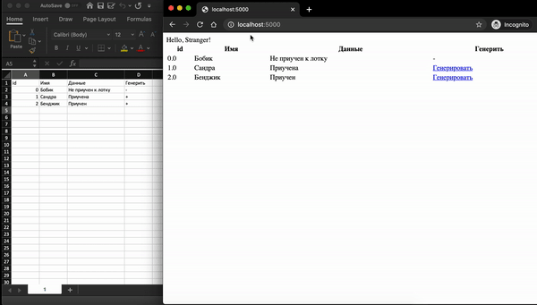

# This code snipped is tool for text replacement in Python 3

Install next libraries:
```
sudo pip3 install python-docx
sudo pip3 install flask
```

This code snipped works next:
1. It creates flask server in your computer`s localhost
2. It asks to upload a docx and type an old string and a new string
3. It replaces an old string by a new string
4. It sends file to download
5. Code is good commented

Here is how it works:
